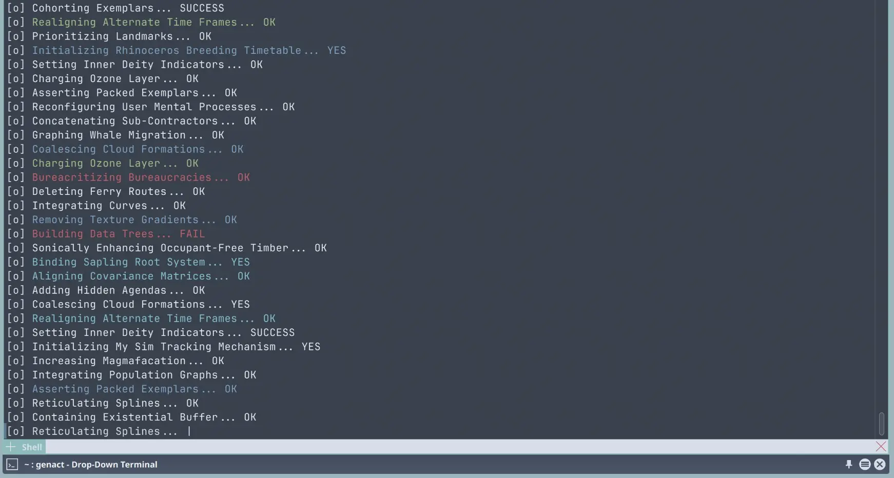

<h1 align="center">
	Nordic for <a href="https://apps.kde.org/yakuake/">Yakuake</a>
</h1>

A nordic theme/skin for Yakuake based on vanilla Yakuake Breeze skin by Andreas Kainz.

	

## ⚙️ Usage

1. Clone this repository
2. Copy `skin` folder (and rename it if you like) to `~/.local/share/yakuake/skins/` (path might be different depends on your distro)
3. Open Yakuake's appearance settings
    1. Click `Menu`
    2. Click `Configure Yakuake...`
    3. Click `Appearance`
4. Select `Nordic` in the list
5. Click `OK`

## 💝 Thanks to

-   Andreas Kainz
-   [Nord](https://www.nordtheme.com/docs/colors-and-palettes)
-   [Catppuccin](https://github.com/catppuccin/yakuake)
